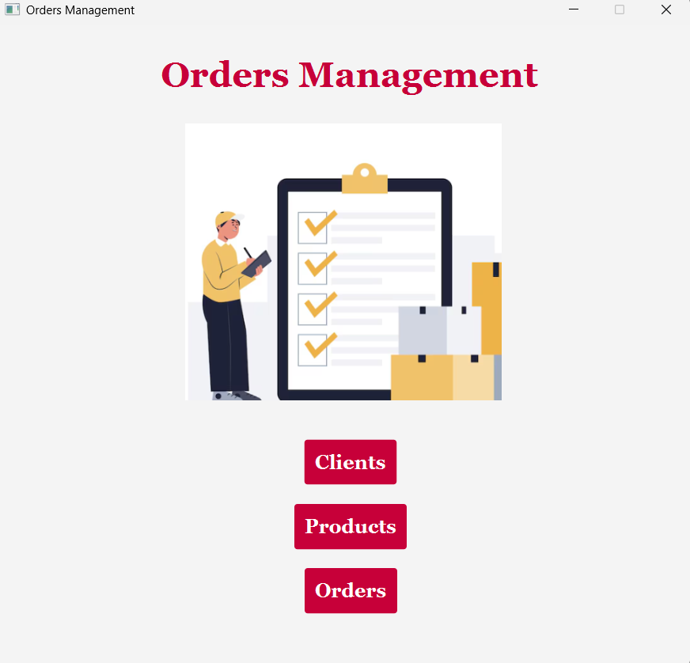

# Order Management System (Java)

A Java application for managing client orders using a layered architecture (BLL, DAO, Model, GUI). The system supports CRUD operations for clients, products, and orders, and integrates a MySQL database for persistent storage.

## Features
- Manage clients, products, and orders
- CRUD operations (Create, Read, Update, Delete)
- Layered architecture:
  - Business Logic Layer (BLL)
  - Data Access Layer (DAO)
  - Model
  - Presentation (JavaFX GUI)
- Input validation using custom validators
- Dynamic table generation using reflection
- Bill generation for processed orders

## Technologies
- Java 17
- JavaFX
- Maven
- JDBC (MySQL)
- Reflection

## Description

The application manages orders by allowing users to add, edit, and delete clients, products, and orders through a graphical interface. Data is stored in a relational database and accessed via DAO classes.

The system uses reflection to dynamically generate queries and populate tables, reducing repetitive code and improving flexibility.

## Notes
- Database schema must be created manually before running the application
- The application uses JDBC for database connectivity
- Reflection is used for dynamic query generation and UI table population
- Input validation is handled through custom validator classes

---

This project was built to practice database integration, object-oriented design, and GUI development in Java.
